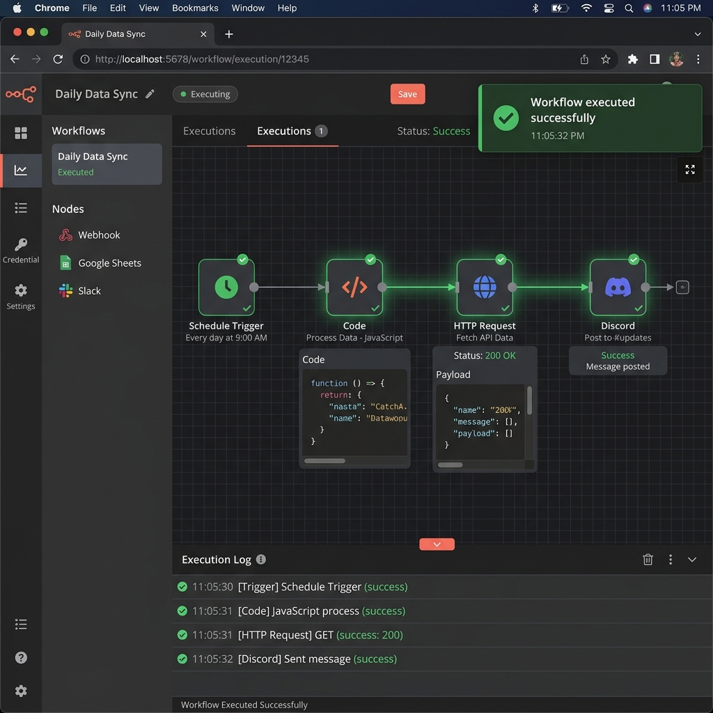

# Weekly GitHub Dev Summary n8n Workflow

This n8n workflow automatically generates a weekly narrative summary of a GitHub repository's activity (commits, closed issues, and merged PRs) using the Claude API, and delivers it via a Discord webhook.

## Setup Instructions

1. **Import the Workflow**: Open your n8n instance, go to your Workflows, click the `+ Add workflow` button, select `Import from File...` in the top right menu, and upload `weekly_dev_summary_workflow.json`.
2. **Configure Variables**: Open the `Config` node (a Set node) and update the values for:
   - `repo`: The GitHub repository (e.g., `claude-builders-bounty/claude-builders-bounty`)
   - `discordWebhook`: Your Discord channel webhook URL for delivery
   - `anthropicApiKey`: Your API key for Claude API
   - `language`: Target language for the summary (e.g., `EN`, `FR`)
3. **Activate**: Toggle the workflow switch at the top right from "Inactive" to "Active" to enable the weekly cron trigger (runs every Friday at 5 PM).

That's it! Your workflow is now set up to automatically generate and deliver weekly summaries.

## Successful Execution

